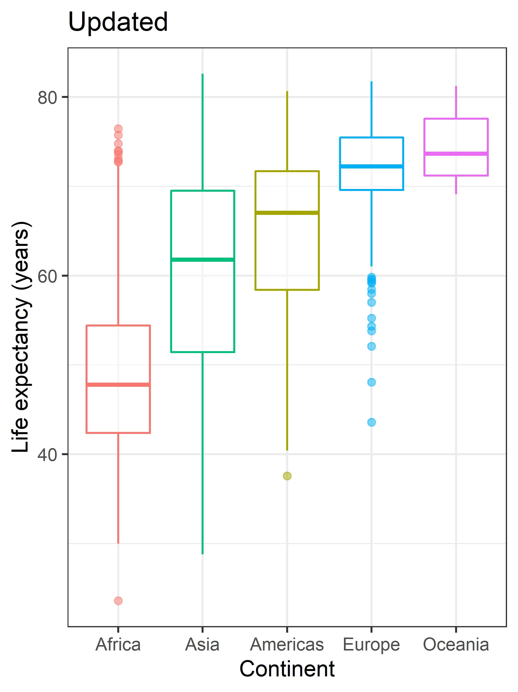

---
title: "STAT 545A Assignment 05: Factor and figure management"
author: "Md. Belal Hossain"
output:
  html_document:
    toc: yes
editor_options:
  chunk_output_type: inline
---  

# Instructions
This is the fifth and final assignment of STAT545A. The details instructions of this assignment can be found [here](https://stat545.stat.ubc.ca/evaluation/hw05/hw05/).


```{r load packages, warning = FALSE, message = FALSE, echo = FALSE}
# load packages here:
library(gapminder)
library(tidyverse)
library(knitr)
library(kableExtra)
library(DT)
library(here)
```

# Exercise 1: Explain the value of the here::here package
> Task: In your own words, summarize the value of the here::here package in 250 words or fewer.

The function `setwd()` is a way to set a working directory, while `rm(list=ls())` is a way to remove all objects from a specified environment. The `here::here` package is more flexible than using these two base R functions. In particular, the functions `setwd()` and `rm(list=ls())` are not very straightforward and somehow problematic when working in a R project. For example, although `rm()` removes all objects from the workspace, it is still difficult to get a clean R session by using this command. In fact, it can only remove the objects from a local environment, but not from a global environment. On the other hand, `setwd()` requires a specific path to the working directory. This function is not working well particularly in a collaborative project where the path of the directory differs for every collaborator (or user). The `here::here` function mitigates these problems, and is a way to find the files from a folder and removes the reproducibility issue. Specifically, it removes the problem of manually specifying a working directory, which allows an easy way to navigate R projects and save files within the specified project. 

Moreover, the `Rmarkdown` usually sets a local working directory which might be different from a working folder. The `here::here` function also works well outside of an Rstudio project as the path is specified according to a hierarchy. 


# Exercise 2: Factor management
> Task: Choose one dataset (of your choice) and a variable to explore: 1) Drop factor/levels; 2) Reorder levels based on knowledge from data. Also, Explore the effects of re-leveling a factor in a tibble by: 1) Comparing the results of arrange on the original and re-leveled factor; 2) Plotting a figure of before/after re-leveling the factor.

## Elaboration for the gapminder data set
###Drop levels
Before dropping levels of a factor (continent of the gapminder dataset), let us see the number of observations, number of levels and names of those levels first. 

```{r, warning=FALSE}
gapminder %>% 
  nrow()

gapminder$continent %>% 
  nlevels() 

gapminder$continent %>% 
  levels() 
```

It seems there are 1704 observations in the continent variable, with 5 distinct levels: Africa, Americas, Asia, Europe, and Oceania. Now we will drop the level 'Oceania', and see the number of observations, number of levels and name of these levels.


```{r, warning=FALSE}
gapminder_drop <- gapminder %>% 
  filter(continent != "Oceania") 

gapminder_drop %>% 
  nrow()

gapminder_drop$continent %>% 
  nlevels() 

gapminder_drop$continent %>% 
  levels() 
```

It seems filtering reduces the number of observations, but it does not change the levels of a factor. Now using `droplevels` command, we will drop the level 'Oceania', and see the number of observations, number of levels and name of these levels.

```{r, warning=FALSE}
continent_new <-  droplevels(gapminder_drop$continent) # dropping unused level

gapminder_drop1 <- cbind(gapminder_drop, continent_new) # Combine two datasets 

levels(gapminder_drop1$continent) # Old levels
levels(gapminder_drop1$continent_new) # New levels
```

It seems there are only 4 levels for the new factor and the level 'Oceania' was successfully dropped. We can also check it by `arrange` function:

```{r}
gapminder_drop1 %>% 
  arrange(continent, group_by = continent_new) %>% 
  DT::datatable()
```

Also, using a simple cross-table, we can verify it:
```{r}
table(gapminder_drop1$continent, gapminder_drop1$continent_new) %>% 
  knitr::kable() %>% 
  kable_styling(latex_options = "scale_down")
```

It seems the level 'Oceania' was dropped successfully from the new factor.

### Reorder levels
Let us explore the 'continent' variable of the gapminder dataset.

```{r}
gapminder$continent %>% 
  levels()
```

It seems the factor variable has five levels where the levels starts from Africa. Now we will reorder the levels which will now start from 'Oceania'.

```{r}
gapminder$continent %>% 
  forcats::fct_relevel("Oceania") %>% 
  levels() 
```

A plot is given below to show the maximum GDP per capita per continent. The first figure is without re-leveling the variable and the second figure is after re-leveling. Another figure is also added after re-ordering the level according to the smallest to largest value.

```{r, warning=FALSE, fig.width=9.2}
fig_before <- gapminder %>% 
  group_by(continent) %>% 
  summarise(Maximum = max(gdpPercap)) %>%
  ggplot(aes(y = Maximum, x = continent)) +
  geom_point() + 
  xlab("") + 
  scale_y_log10("GDP per capita", labels = scales::dollar_format()) + 
  ggtitle("Before re-leveling") + 
  theme(axis.text.x = element_text(angle = 90)) 

fig_after <- gapminder %>% 
  group_by(continent) %>% 
  summarise(Maximum = max(gdpPercap)) %>%
  ggplot(aes(y = Maximum, x = continent)) +
  geom_point(aes(x = fct_relevel(continent, "Oceania"))) + 
  xlab("") + 
  scale_y_log10("", labels = scales::dollar_format()) + 
  ggtitle("After re-leveling") + 
  theme(axis.text.x = element_text(angle = 90))  

fig_after1 <- gapminder %>% 
  group_by(continent) %>% 
  summarise(Maximum = max(gdpPercap)) %>%
  ggplot(aes(y = Maximum, x = continent)) +
  geom_point(aes(x = fct_reorder(continent, Maximum, "identity"))) + 
  xlab("") + 
  scale_y_log10("", labels = scales::dollar_format()) + 
  ggtitle("After re-ordering") + 
  theme(axis.text.x = element_text(angle = 90)) 

gridExtra::grid.arrange(fig_before, fig_after, fig_after1, nrow = 1, top = "Maximum GDP per capita in five continents between 1952 and 2007")
```

# Exercise 3: File input/output (I/O)
> Task: Experiment with at least one of: 1) write_csv()/read_csv(), and/or TSV friends; 2) saveRDS()/readRDS(); 3) dput()/dget().

## Saving a file using write_csv()
Let us fit a linear regression model by considering `Life Expectancy` as the dependent variable and `GDP per capita`, `Year` and `Continent` as the independent variables. Let us then predict the `Life expectancy` variable and add this variable with the `gapminder` dataset. 

```{r, warning=FALSE, message=FALSE}
gapminder$fit.pr <- predict(lm(lifeExp ~ gdpPercap + I(year-1952) + continent, data = gapminder))
```

Now we will save it in CSV format in the 'hw05' folder. We will use `here` package in this case. The new name of the saved dataset will be `gapminder_lm`:
```{r}
gapminder %>% 
    write_csv(here::here("./hw05/gapminder_lm.csv"))
```

## Read a file using read_csv()
Now we will read the saved `gapminder_lm` dataset from 'hw05' folder. Again, we will use `here` package.  

```{r, warning=FALSE, message=FALSE}
gapminder.dat <- read_csv(here::here("./hw05/gapminder_lm.csv"))
```

## Playing with the imported dataset

### Level factors
```{r, warning=FALSE, message=FALSE}
gapminder.dat$continent %>% 
  levels() 
```
We can see that the `continent` variable in the new dataset has no level. Now we will put level on it:
```{r, warning=FALSE, message=FALSE}
gapminder.dat$continent %>% 
  as_factor() %>% 
  levels() 
```

We can also use the following way to do it. First, create a new variable and the reorder factor levels by sorting along the original `continent` variable

```{r}
gapminder.dat$continent_new <- with(gapminder, fct_reorder(continent, lifeExp, max))

gapminder.dat$continent_new %>% 
  levels()
```

Now, we will check whether the new variable produces the same value as the old variable. First, we will check the length of both variables, the run a cross-table with exactly the same cases.

```{r}
length(gapminder.dat$continent)
length(gapminder.dat$continent_new)
table(gapminder.dat$continent==gapminder.dat$continent_new)
```
It seems the new variable created exactly the same value as the old one.

### Creating a plot

Now we will produce two histograms to show the distribution of the life expectancy variable using the observed (the original) and predicted (using linear model) dataset. The figures are given below:

```{r, warning=FALSE, message=FALSE}
p1 <- gapminder.dat %>% 
  ggplot(aes(x = lifeExp)) +
  geom_histogram(aes(y=..density..), color = "black", fill = "white") + 
  ggtitle("Observed life expectancy") + 
  xlab("Life Expectancy") +
  theme_bw() 

p2 <- gapminder.dat %>% 
  ggplot(aes(x = fit.pr)) +
  geom_histogram(aes(y=..density..), color = "black", fill = "white") + 
  ggtitle("Predicted life expectancy") + 
  xlab("Life Expectancy") +
  theme_bw() 

gridExtra::grid.arrange(p1, p2, nrow = 1, top = "Histogram of life expectancy using observed and predicted dataset")
```

### Comment
> For the I/O method(s) you chose, comment on whether or not your newly created file survived the round trip of writing to file then reading back in.

The newly created dataset survived the round trip of writing data to file and being read back into `R`. However, it should be noted that 'factor' variables are imported as 'character'. We need to use `as_factor` to make them factor again. 

# Exercise 4: Visualization design
> Task: Go back through your previous assignments and class participation activities and find figures you created prior to the last week of the course. Recreate at least one figure in light of something you learned in the recent class meetings about visualization design and color.

In the [Assignment 2](https://stat545-ubc-hw-2019-20.github.io/stat545-hw-belalanik/hw02/hw02.html), I have used a box plot that shows the [five-number summary](https://towardsdatascience.com/understanding-boxplots-5e2df7bcbd51) of the life expectancy variable for each of five continents.The plot was black and white and was unordered. Now I have colored the plot by continent and ordered it by the median life expectancy value. The plots are also shown using [side-by-side](https://www.rdocumentation.org/packages/gridExtra/versions/2.3). 

```{r, warning=FALSE, fig.width=10}
plot1 <- gapminder %>% 
ggplot(aes( x = continent, y = lifeExp)) +
  geom_boxplot() + xlab("Continent") + ylab("Life expectancy (years)") + 
  ggtitle("Old") + 
  theme_bw()

plot2 <- gapminder %>% 
ggplot(aes( x = continent, y = lifeExp, color = continent)) +
  geom_boxplot(aes(fct_reorder(continent, lifeExp, median)), alpha=0.5) + 
  xlab("Continent") + ylab("Life expectancy (years)") + 
  ggtitle("Updated") + 
  scale_colour_discrete(guide = FALSE) + 
  theme_bw() 

gridExtra::grid.arrange(plot1, plot2, nrow = 1, top = "Life expectancy between 1952 and 2007 in five continents")
```

Clearly, the plot on the right side looks better than the left one. We can clearly see the trend and can identify the continent having the smallest or largest life expectancy. Also, the color map makes the plot more depictable.

# Exercise 5: Writing figures to file
> Task: Use ggsave() to explicitly save a plot to file. Include the exported plot as part of your repository and assignment. Then, load and embed that file into your report.

Without specifying anything, the `ggsave` command saves the last plot that is displayed. Now I will save the boxplot named 'plot2' as a 'jpg' file. Let us call it 'boxplot.jpg'. I am using `here` package to do it. I will specify some arguments such as 600 dpi, height and width of the figure. The following command can be used to do this:

```{r, warning=FALSE}
ggsave(filename = here::here("boxplot.jpg"), plot = plot2, width = 5, height = 6, 
       units = "cm", dpi = 600)
```

Finally, the figure is then loaded and embeded into a report:




